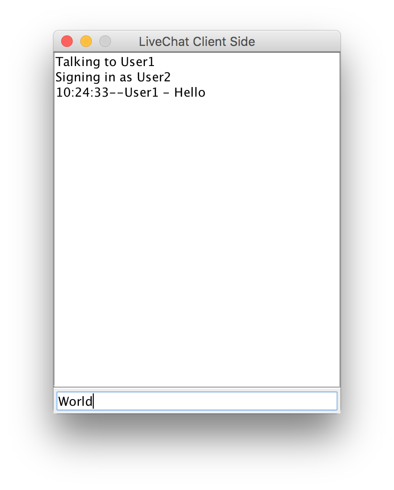
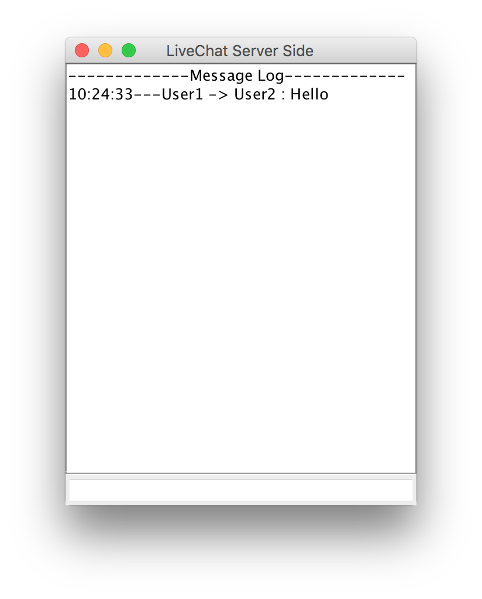

# My_Messenger

This is a program that supports sending and receiving messages between multiple users simultaneously. It features a Graphical User Inteface on both the client side and the server side.  

# Screenshots

### User 1

### User2

### Server

